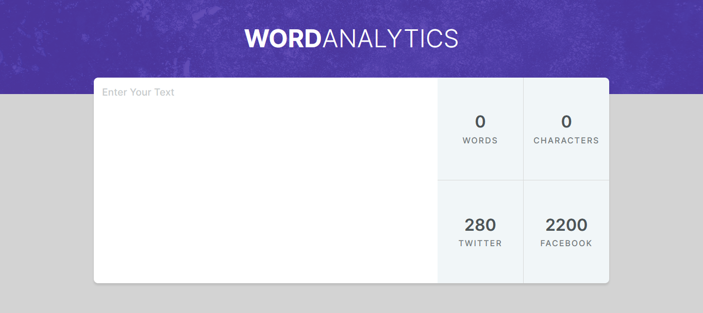

# Word-Analytics

## Table of Contents

- [Word-Analytics](#word-analytics)
  - [Table of Contents](#table-of-contents)
  - [Project Overview](#project-overview)
  - [Demo](#demo)
  - [Key Features](#key-features)
  - [How to Use](#how-to-use)
  - [Contributing](#contributing)
  - [License](#license)
  - [Acknowledgments](#acknowledgments)

## Project Overview

This is a simple JavaScript tool that allows users to count characters and words in a text input field. It also provides real-time feedback on the remaining characters for Twitter and Facebook posts.



## Demo

- Live demo: [Word Analytics](https://dz-word-analytics.netlify.app/)

## Key Features

1. **Character Count**: The tool counts the number of characters entered in the text input field and displays it in real-time.

2. **Word Count**: It also calculates the number of words in the input and updates the count as the user types.

3. **Twitter Character Limit**: For Twitter users, the tool displays the remaining characters allowed for a tweet (Twitter allows 280 characters).

4. **Twitter Character Limit Indicator**: It visually indicates if the Twitter character limit has been exceeded by changing the color when the limit is reached.

5. **Facebook Character Limit**: For Facebook users, the tool displays the remaining characters allowed for a post .

6. **Facebook Character Limit Indicator**: Similar to Twitter, it visually indicates if the Facebook character limit has been exceeded.

## How to Use

1. **Clone the repository**:

First, you'll need to clone this repository to your local machine. Open your terminal and run the following command:

```git
git clone https://github.com/hichamweblog/Word-Analytics.git

```

2. **Navigate to the Project Folder**:

Change your working directory to the newly cloned project folder:

```git
 cd Word-Analytics
```

3. **Install Dependencies**:

Install the required packages by running:

```git
npm install
```

4. **Run the project**:

```git
npm run dev
```

This command will launch a development server, and you'll be able to view the website locally in your web browser.

## Contributing

If you would like to contribute to this repository, feel free to open issues or submit pull requests. Contributions and improvements are always welcome.

## License

This project is licensed under the [MIT License](./LICENSE).

## Acknowledgments

This project is inspired by [this course](https://bytegrad.com/courses/professional-javascript).
Special thanks to the instructor.

